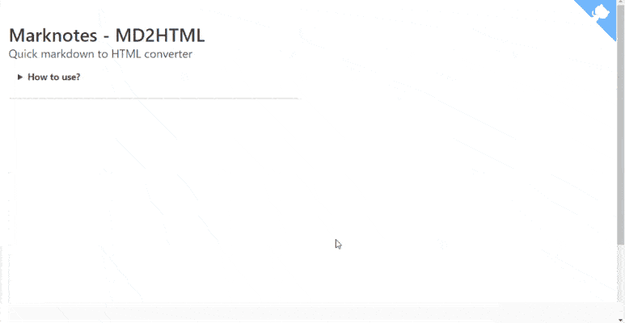

# marknotes_html2md

> Quick HTML to markdown converter

## Table of Contents

-   [Install](#install)
-   [Build Setup](#build-setup)
-   [Usage](#usage)
-   [Tips](#tips)
-   [Author](#author)
-   [License](#license)

## Install

Clone this repository or click on the `[Clone or download](https://github.com/cavo789/marknotes_html2md/archive/master.zip)` green button and get a copy of the program.

You can also use the [interface online](https://html2md.avonture.be) without installing anything.

## Build Setup

Only if you're a developer and need to change something. **If not, just ignore this chapter.**

Once downloaded to your computer, go to the prompt to execute the following instructions:

```bash
npm install
```

This first instruction will install all dependencies needed by the program.

```bash
npm run dev
```

This second instruction will start a localhost site (like `http://localhost:8080/`) with hot reloading: by updating the source code, the change will be immediately reflected without the need to refresh the page.

When your changes are finished, you can build a final version by running:

```bash
npm run build
```

This third and last instruction will consolidate and minify your assets into a single file called `dist/build.js`. When this step is done, you can access your local site without the need to run `npm run dev`; you're ready for publishing the site to Internet or somewhere else.

For detailed explanation on how things work, consult the [docs for vue-loader](http://vuejs.github.io/vue-loader).

## Usage

Type your markdown code in the editor, the HTML conversion is done on-the-fly.

At the bottom of the page, you have a button for maximizing the HTML part (by hiding everything else) or two buttons for copying in the clipboard the HTML rendering or the HTML source code.mail f.i.



## Tips

-   You can type something like `==important part==` to put that section in a highlighted section.
-   When the markdown content start with a YAML block, that block is ignored during the HTML conversion

## Author

Christophe Avonture

## License

[MIT](LICENSE)
