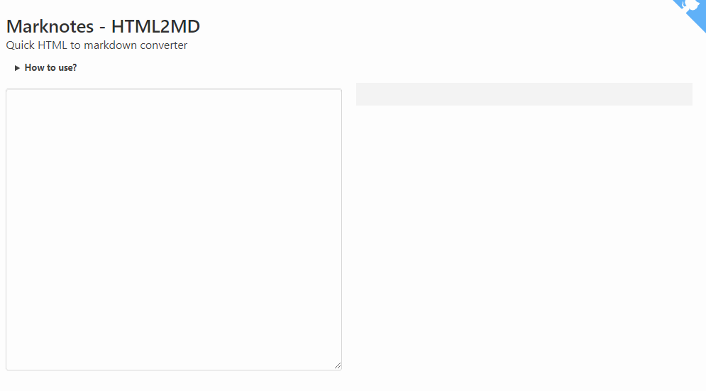

# marknotes_html2md

> Quick HTML to markdown converter

**Conversion is made in javascript, no server side action needed so nothing is sent to internet.**

## Table of Contents

* [Table of Contents](#Table-of-Contents)
* [Install](#Install)
* [Usage](#Usage)
* [Cool things](#Cool-things)
  * [Using the url querystring parameter](#Using-the-url-querystring-parameter)
  * [Get content not the page](#Get-content-not-the-page)
  * [Convert back MD to HTML](#Convert-back-MD-to-HTML)
* [You are a developer and you want to modify the code?](#You-are-a-developer-and-you-want-to-modify-the-code)
* [Author](#Author)
* [License](#License)

## Install

Do you need a local copy of this script? If no, don't install anything, just use it online: [https://html2md.avonture.be](https://html2md.avonture.be).

Otherwise, if you want a copy on your own server; just clone this repository or click on the `[Clone or download](https://github.com/cavo789/marknotes_html2md/archive/master.zip)` green button and get a copy of the program.

## Usage

You can either enter a valid URL or type your html code in the editor in the left part and the markdown conversion will be on-the-fly. Just in real time.

At the bottom of the page, you have a button for maximizing the markdown part (by hiding everything else) and a `Copy` button for copying in the clipboard the markdown source code.



## Cool things

### Using the url querystring parameter

You can directly convert a page by specifying his URL like this : `https://html2md.avonture.be/?url=https://domain/page.html` i.e. by setting the `url` parameter on the querystring.

This allow automation like, f.i., building a bookmarklet or providing a list of parametrized urls to get such HTML2MD conversion.

### Get content not the page

When you type an URL, the script will do his best to only focus on the content and not the page: page headers will be removed, html tags like `<style>`, `<script>`, `<header>`, `<footer>`, `<navigation>`, ... will be ignored while tags like `<article>` or `<content>` will be targeted.

### Convert back MD to HTML

Use [https://md2html.avonture.be/](https://md2html.avonture.be/) to convert back the markdown to HTML.

Why is it cool? Because MD content is easily translatable (just copy/paste into f.i. [https://www.deepl.com/translator](https://www.deepl.com/translator)). You'll get the text, in your language without fioritures.

## You are a developer and you want to modify the code?

Only if you're a developer and need to change something. **If not, just ignore this chapter.**

Once downloaded to your computer, go to the prompt to execute the following instructions:

```bash
npm install
```

This first instruction will install all dependencies needed by the program.

```bash
npm run dev
```

This second instruction will start a localhost site (like `http://localhost:8080/`) with hot reloading: by updating the source code, the change will be immediately reflected without the need to refresh the page.

When your changes are finished, you can build a final version by running:

```bash
npm run build
```

This third and last instruction will consolidate and minify your assets into a single file called `dist/build.js`. When this step is done, you can access your local site without the need to run `npm run dev`; you're ready for publishing the site to Internet or somewhere else.

For detailed explanation on how things work, consult the [docs for vue-loader](http://vuejs.github.io/vue-loader).

## Author

Christophe Avonture

## License

[MIT](LICENSE)
